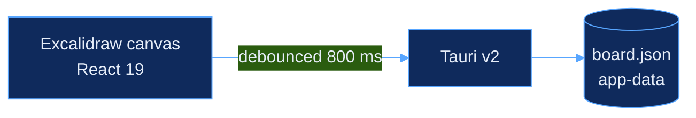

  <picture>
    <source media="(prefers-color-scheme: dark)" srcset="assets/banner-dark.svg">
    
  </picture>

I'm a computer science student who likes owning a project end to end: the interface, the data layer, and the part that has to keep working when the network doesn't. Most of my work is TypeScript and Node, with C, Python, Java and Lua for everything else.

## Things I've built

**[Canvas App](https://github.com/IniEyyy/canvas-app)**
A local-first infinite canvas for the desktop. Boards autosave to a file on your machine, so there's no account and no connection needed. MIT licensed.
`Tauri v2` · `React 19` · `Excalidraw`

How it saves your work

**[Seatudy](https://github.com/IniEyyy/seatudy)**
An online learning platform with role-based access, JWT auth and real-time features.
`React` · `Vite` · `Node.js` · `Express` · `PostgreSQL` · `Socket.IO`

**[Jomoro Koffee](https://github.com/IniEyyy/SA)**
A system architecture project built as NestJS microservices.
`NestJS` · `Microservices`

**[Growlauncher Documentation](https://github.com/IniEyyy/Growlauncher-Documentation)** &nbsp; 
API documentation for a Lua scripting tool, put together by testing each function by hand.
`Lua`

**[ML Energy Experiment](https://github.com/IniEyyy/ML-Energy-Experiment)**
An academic research experiment.

**[Portofolio](https://github.com/IniEyyy/portofolio)**
My portfolio site. Static, one page.
`Astro` · `Tailwind CSS`

## Right now

- Extending Canvas App: PDF export, multi-board management, media overlays
- Finishing my portfolio site

## Stack

  
  
  
  
  
  

  
  
  
  
  

  
  
  
  
  

## How I work

I use AI coding agents for implementation. The architecture, the trade-offs and the review are still mine.

Issues and discussions are open on every repo above.
